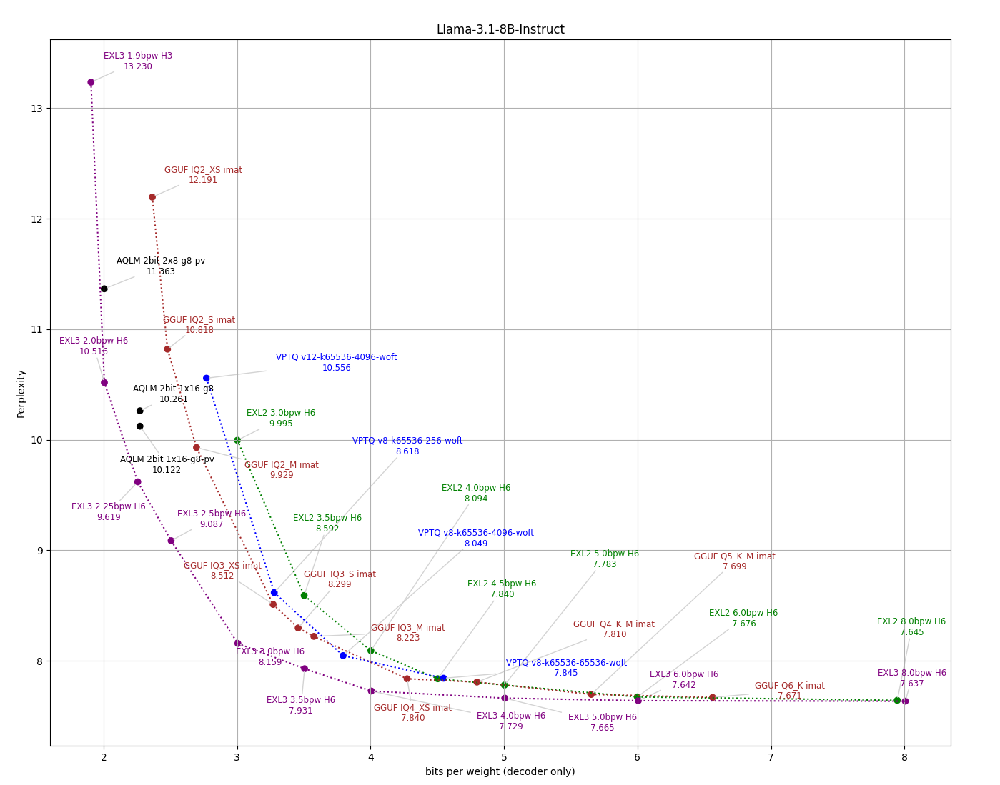

#  ExLlamaV3

ExLlamaV3 is an inference library for running local LLMs on modern consumer GPUs. Headline features:

- New [EXL3](doc/exl3.md) quantization format based on QTIP
- Flexible tensor-parallel and expert-parallel inference for consumer hardware setups
- OpenAI-compatible server provided via [TabbyAPI](https://github.com/theroyallab/tabbyAPI/) 
- Continuous, dynamic batching
- HF Transformers plugin (see [here](examples/transformers_integration.py))
- HF model support (see [supported architectures](#architecture-support))
- Speculative decoding
- 2-8 bit cache quantization
- Multimodal support
- LoRA support

The official and recommended backend server for ExLlamaV3 is [TabbyAPI](https://github.com/theroyallab/tabbyAPI/), which provides an OpenAI-compatible API for local or remote inference, with extended features like HF model downloading, embedding model support and support for HF Jinja2 chat templates.

## Architecture support

- **AFM** (ArceeForCausalLM)
- **AfMoE** (AfmoeForCausalLM)
- **Apertus** (ApertursForCausalLM)
- **Command-R** etc. (CohereForCausalLM)
- **Command-A**, **Command-R7B**, **Command-R+** etc. (Cohere2ForCausalLM)
- **DeciLM**, **Nemotron** (DeciLMForCausalLM)
- **Deepseek V3** (DeepseekV3ForCausalLM)
- **Deepseek V4** (DeepseekV4ForCausalLM)
- **dots.llm1** (Dots1ForCausalLM) (`n_group>1` currently not supported)
- **ERNIE 4.5** (Ernie4_5_ForCausalLM, Ernie4_5_MoeForCausalLM)
- **EXAONE 4.0** (Exaone4ForCausalLM)
- **Gemma 2** (Gemma2ForCausalLM)
- **Gemma 3** (Gemma3ForCausalLM, Gemma3ForConditionalGeneration) *- multimodal*
- **Gemma 4** (Gemma4ForConditionalGeneration, Gemma4UnifiedForConditionalGeneration) *- multimodal* (E2B/E4B currently not supported)
- **GLM 4**, **GLM 4.5**, **GLM 4.5-Air**, **GLM 4.6** (Glm4ForCausalLM, Glm4MoeForCausalLM)
- **GLM 4.1V**, **GLM 4.5V** (Glm4vForConditionalGeneration, Glm4vMoeForConditionalGeneration) *- multimodal*
- **GLM 5.2** (GlmMoeDsaForCausalLM)
- **GLM 5.3-Flash** (Glm5NextForConditionalGeneration) *- multimodal*
- **GPT-OSS** (GptOssForCausalLM)
- **HyperCLOVAX** (HyperCLOVAXForCausalLM, HCXVisionV2ForCausalLM) *- multimodal*
- **Hy3** (HYV3ForCausalLM)
- **IQuest-Coder** (IQuestCoderForCausalLM)
- **Laguna 2.1** (LagunaForCausalLM)
- **LFM 2.5** (Lfm2MoeForCausalLM)
- **Llama**, **Llama 2**, **Llama 3**, **Llama 3.1-Nemotron** etc. (LlamaForCausalLM)
- **MiMo-RL** (MiMoForCausalLM)
- **MiniMax-M2** (MiniMaxM2ForCausalLM)
- **Mistral**, **Ministral 3**, **Devstral 2**, **Mistral-4** etc. (MistralForCausalLM, Mistral3ForConditionalGeneration) *- multimodal*
- **Mixtral** (MixtralForCausalLM)
- **NemotronH, Nemotron-3** (NemotronHForCausalLM)
- **Olmo 3.1** (Olmo3ForCausalLM)
- **Olmo-Hybrid** (OlmoHybridForCausalLM)
- **Phi3**, **Phi4** (Phi3ForCausalLM)
- **Qwen 2**, **Qwen 2.5**, **Qwen 2.5 VL** (Qwen2ForCausalLM, Qwen2_5_VLForConditionalGeneration) *- multimodal*
- **Qwen 3** (Qwen3ForCausalLM, Qwen3MoeForCausalLM)
- **Qwen 3-Next** (Qwen3NextForCausalLM)
- **Qwen 3-VL** (Qwen3VLForConditionalGeneration)  *- multimodal*
- **Qwen 3-VL MoE** (Qwen3VLMoeForConditionalGeneration) *- multimodal*
- **Qwen 3.5** (Qwen3_5ForConditionalGeneration) *- multimodal*
- **Qwen 3.5 MoE** (Qwen3_5MoeForConditionalGeneration) *- multimodal*
- **Qwen 3.8-Flash-Next** (Qwen4ExpForConditionalGeneration) *- multimodal*
- **Seed-OSS** (SeedOssForCausalLM)
- **SmolLM** (SmolLM3ForCausalLM)
- **SolarOpen** (SolarOpenForCausalLM)
- **Step 3.5 Flash** (Step3p5ForCausalLM)
- **Step 3.7 Flash** (Step3p7ForConditionalGeneration) *- multimodal*

Always adding more, stay tuned.


## What's missing?

Currently on the to-do list:

- ROCm support

As for what is implemented, expect that some things may be a little broken at first. Please be patient, raise issues and/or contribute. 👉👈 


## How to?

[TabbyAPI](https://github.com/theroyallab/tabbyAPI/) has a startup script that manages and installs prerequisites if you want to get started quickly with inference in an OAI-compatible client. 

Otherwise, start by making sure you have the appropriate version of [PyTorch](https://pytorch.org/get-started/locally/) installed (CUDA 12.4 or later) since the Torch dependency is not automatically handled by `pip`. Then pick a method below:

### Method 1: Installing from prebuilt wheel (recommended if you're unsure)

Pick a wheel from the [releases page](https://github.com/turboderp-org/exllamav3/releases), then e.g.:

```sh
pip install https://github.com/turboderp-org/exllamav3/releases/download/v0.0.6/exllamav3-0.0.6+cu128.torch2.8.0-cp313-cp313-linux_x86_64.whl
```

### Method 2: Installing from PyPi:

```sh
pip install exllamav3
```
Note that the PyPi package does not contain a prebuilt extension and requires the CUDA toolkit and build prerequisites (i.e. VS Build Tools on Windows, gcc on Linux, `python-dev` headers etc.).    

### Method 3: Building from source

`exllamav3` declares a minimum `torch` version (>= 2.6.0) and CUDA version (>= 12.4), but beyond that the user is free to select a version of `torch` that is compatible with their environment.

`torch` can be installed in three ways (from least to most effort):
1. **with `uv`, setting only `--group cuXXX`** installs `torch` automatically with the specified CUDA version, `torch` version is selected by `uv` from compatible versions in the specific index associated with the chosen CUDA version (options 1 and 2)
2. **with `uv`, setting `--group cuXXX` and pinning a torch version inside that group** (applicable to non-Github `uv` install paths in options 1 and 2) — see the [pinning a specific PyTorch version (optional)](#pinning-a-specific-pytorch-version-optional) section for details (note a global `[tool.uv] constraint-dependencies` does not work for this)
3. Manually with `uv pip` or `pip` (options 3 and 4)

The CUDA flavors are declared as uv **dependency groups** (`cu124`, `cu126`, `cu128`, `cu129`, `cu130`, `cu132`) — pick the one matching your installed CUDA build by passing `--group <flavor>` to `uv sync` / `uv run`. While developing you can also set `[tool.uv] default-groups = ["cuXXX"]` to make a flavor the default for the project (see [Pinning the CUDA flavor for local development](#pinning-the-cuda-flavor-for-local-development)). Both `uv sync` and `pip install .` build the package in an isolated environment where your `torch` is not visible, so they install the extension sources and compile them at first import (JIT, a few minutes once per torch version). For a precompiled install run `pip install --no-build-isolation .` in an environment that already has `torch`, or use the release wheels. Selecting a flavor installs the matching CUDA build of `torch`; `flash-attn` is optional and installed separately (see [Prebuilt flash-attn](#prebuilt-flash-attn)).

##### Pinning the CUDA flavor for local development

If you're developing on the repo and always want a particular CUDA flavor without passing
`--group` every time, set it as the project default under `[tool.uv]`:

```toml
[tool.uv]
default-groups = ["cu132"]
```

With that in place, plain `uv sync` / `uv run` enable the `cu132` group (and its
pinned `torch`).

**Option 1 — Working in the cloned repo directly (`uv sync`):**

```sh
git clone https://github.com/turboderp-org/exllamav3
cd exllamav3
# (Optional) switch to dev branch for latest in-progress features
git checkout dev

uv venv
uv sync --group cu130          # pick the CUDA flavor matching your build
# while developing, default a flavor for the repo via [tool.uv] default-groups
# non-CUDA optional dependencies are installed as before:
uv sync --group examples --group eval
```

**Option 2 — Using `exllamav3` as a dependency from another project (`uv add`):**

The CUDA flavor groups belong to this repo's own `pyproject.toml`; a dependent project cannot
select them (`exllamav3[cu130]` is not an extra and uv will warn that it doesn't exist). Add the
package plainly and choose `torch` in your own project, either by installing it first
(`uv pip install torch --torch-backend=auto`) or by declaring a `[tool.uv.sources]` entry for
`torch` pointing at the PyTorch index for your CUDA version, as this repo does.

```sh
# `uv add` works inside an existing project (a directory with a pyproject.toml).
# `uv init` creates one if you're starting a new project.
uv init my-project
cd my-project

# local checkout
uv add path/to/exllamav3               # non-editable
uv add path/to/exllamav3 --editable    # editable

# straight from GitHub
uv add 'git+https://github.com/turboderp-org/exllamav3.git'                 # default branch
uv add 'git+https://github.com/turboderp-org/exllamav3.git' --branch dev    # specific branch
```

**Option 3 — Bring your own `torch` and let `uv` pick the backend automatically:**

```sh
uv venv            # or: uv venv --python-preference only-managed
source .venv/bin/activate
uv pip install torch --torch-backend=auto
uv pip install .
```

`--torch-backend=auto` inspects your system and installs the matching PyTorch CUDA build; see [Automatic backend selection](https://docs.astral.sh/uv/guides/integration/pytorch/#automatic-backend-selection).

**Option 4 — With `pip`:**

Install a `flash-attn-2` wheel, e.g. from [here](https://mjunya.com/flash-attention-prebuild-wheels/).

On Windows, you should also make sure you have the `triton-windows` package installed. ExLlamaV3 may work without it, but many things will work suboptimally.   

```sh
# install a CUDA-enabled torch first so it matches your setup, e.g.:
pip install torch --index-url https://download.pytorch.org/whl/cu128
pip install .
```

#### Prebuilt flash-attn

Compiling `flash-attn` from source is extremely slow, so it is strongly recommended to install a **prebuilt wheel**. The CUDA flavor groups do **not** pull in `flash-attn` automatically; install it yourself, matching the `torch` build, CUDA flavor, Python version, and platform you're running. Two options:

1. **Manually** — pick a `flash-attn-2` wheel for your setup, e.g. from [here](https://mjunya.com/flash-attention-prebuild-wheels/), and install it (e.g. `uv pip install <wheel-url>`).
2. **With the helper** — `scripts/flash_attn_install.py` detects your environment (torch build, CUDA flavor, Python, platform), finds the exact matching wheel from [`mjun0812/flash-attention-prebuild-wheels`](https://github.com/mjun0812/flash-attention-prebuild-wheels), and — after a `[Yn]` confirmation — runs the corresponding `uv pip install <release-url>`.

##### Installing flash-attn into an existing environment directly

If you already have a CUDA `torch` installed in an environment and just want to add a
matching prebuilt `flash-attn` wheel, `scripts/flash_attn_install.py` detects that
environment (torch build, CUDA flavor, Python, platform), finds the exact matching wheel
from `mjun0812/flash-attention-prebuild-wheels`, and — after a `[Yn]` confirmation —
runs the corresponding `uv pip install <release-url>`. Run it with an active torch
environment, or pass its python explicitly:

The install target is resolved in this order: (1) the active `VIRTUAL_ENV`, (2) the
python uv would use for the project (`pyproject.toml` in the current dir or parents, via
`uv run python`), (3) an explicit `--python-bin`, (4) an error otherwise.

```sh
uv run scripts/flash_attn_install.py                    # active VIRTUAL_ENV, else project
uv run scripts/flash_attn_install.py --python-bin /path/to/python
```

Only stdlib plus `rich` (declared as a PEP 723 inline dependency) are used. It prints a
summary of what it detected and the exact install command before asking for confirmation.

#### Pinning a specific PyTorch version (optional)
The CUDA flavor group picks the *index*, but by default torch resolves to the latest version on that index that satisfies `>=2.6.0`. To pin a specific torch version, set it **inside the flavor's dependency group** — you can use the plain version without a `+cuXXX` suffix, and uv resolves it against that flavor's index. A global `[tool.uv] constraint-dependencies` does *not* work for this, because it would have to hold for every group at once (each CUDA index uses a different `+cuXXX` local version) and locking fails.

```toml
[dependency-groups]
cu130 = ["torch==2.11.0"]
```

Then `uv sync --group cu130` installs `torch==2.11.0+cu130` from the cu130 index. (You do not need to write the `+cuXXX` suffix yourself — uv matches `torch==2.11.0` to that flavor's local build.)

Or, if you're installing torch manually with `uv pip install torch` (e.g. as in Option 3 above), specify the version directly, e.g. `uv pip install "torch==2.11.0" --torch-backend=auto`.

---

After installing with one of the options above, you should be able to run the conversion, eval and example scripts from the main repo directory, e.g., `uv run python convert.pt -i ...` or, for manual installations once the venv is active, `python convert.py -i ...`

Relevant env variables for building:
- `MAX_JOBS`: by default ninja may launch too many processes and run out of system memory for compilation. Set this to a reasonable value like 4 in that case.  
- `EXLLAMA_NOCOMPILE`: set to install the library without compiling the C++/CUDA extension. Torch will build/load it at runtime instead.

## Conversion

To convert a model to EXL3 format, use:

```sh
# Convert model
python convert.py -i <input_dir> -o <output_dir> -w <working_dir> -b <bitrate>

# Resume an interrupted quant job
python convert.py -w <working_dir> -r

# More options
python convert.py -h
```

The working directory is temporary storage for state checkpoints and for storing quantized tensors until the converted model can be compiled. It should have enough free space to store an entire copy of the output model. Note that while EXL2 conversion by default resumes an interrupted job when pointed to an existing folder, EXL3 needs you to explicitly resume with the `-r`/`--resume` argument.    

See [here](doc/convert.md) for more information.


## Examples

A number of example scripts are provided to showcase the features of the backend and generator. Some of them have hardcoded model paths and should be edited before you run them, but there is a simple CLI chatbot that you can start with:

```sh
python examples/chat.py -m <input_dir> -mode <prompt_mode> 

# E.g.:
python examples/chat.py -m /mnt/models/llama3.1-8b-instruct-exl3 -mode llama3

# Wealth of options
python examples/chat.py -h
```

## EXL3 quantization

<div align="center">
    <a href="doc/exl3.md" target="_blank">
        
    </a>
</div>

Despite their amazing achievements, most SOTA quantization techniques remain cumbersome or even prohibitively expensive to use. For instance, **AQLM** quantization of a 70B model takes around **720 GPU-hours** on an A100 server, costing $850 US at the time of writing. ExLlamaV3 aims to address this with the **EXL3** format, which is a streamlined variant of [**QTIP**](https://github.com/Cornell-RelaxML/qtip) from Cornell RelaxML. The conversion process is designed to be simple and efficient and requires only an input model (in HF format) and a target bitrate. By computing Hessians on the fly and thanks to a fused Viterbi kernel, the quantizer can convert a model in a single step, taking a couple of minutes for smaller models, up to a few hours for larger ones (70B+) (on a single RTX 4090 or equivalent GPU.)

The [Marlin](https://github.com/IST-DASLab/marlin)-inspired GEMM kernel achieves roughly memory-bound latency under optimal conditions (4bpw, RTX 4090), though it still needs some work to achieve the same efficiency on Ampere GPUs and to remain memory-bound at lower bitrates.

Since converted models largely retain the original file structure (unlike **EXL2** which renames some tensors in its quest to turn every model into a Llama variant), it will be possible to extend **EXL3** support to other frameworks like HF Transformers and vLLM.

There are some benchmark results [here](doc/exl3.md), and a full writeup on the format is coming soon.

Fun fact: Llama-3.1-70B-EXL3 is coherent at 1.6 bpw. With the output layer quantized to 3 bpw and a 4096-token cache, inference is possible in under 16 GB of VRAM. 


### Community

You are always welcome to join the [ExLlama discord server](https://discord.gg/NSFwVuCjRq) ←🎮  


### 🤗 HuggingFace repos

A selection of EXL3-quantized models is available [here](https://huggingface.co/collections/turboderp/exl3-models-67f2dfe530f05cb9f596d21a). Also shout out the following lovely people:
 
- [ArtusDev](https://huggingface.co/ArtusDev)
- [MikeRoz](https://huggingface.co/MikeRoz) 
- [MetaphoricalCode](https://huggingface.co/MetaphoricalCode) 
- [Ready.Art](https://huggingface.co/ReadyArt) 
- [isogen](https://huggingface.co/isogen/models)


## Acknowledgements

This project owes its existence to a wonderful community of FOSS developers and some very generous supporters (🐈❤️!) The following projects in particular deserve a special mention:

- [TabbyAPI](https://github.com/theroyallab/tabbyAPI/)
- [PyTorch](https://github.com/pytorch/pytorch)
- [FlashAttention](https://github.com/Dao-AILab/flash-attention)
- [QTIP](https://github.com/Cornell-RelaxML/qtip)
- [Transformers](https://github.com/huggingface/transformers)
- [Marlin](https://github.com/IST-DASLab/marlin)
- [Flash Linear Attention](https://github.com/fla-org/flash-linear-attention)
